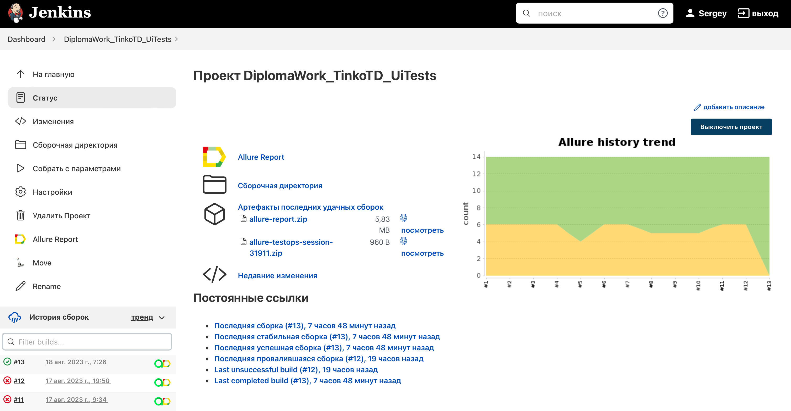
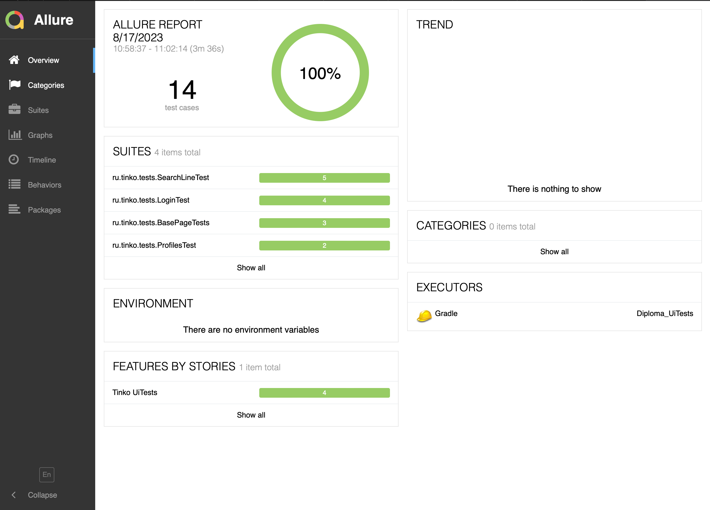
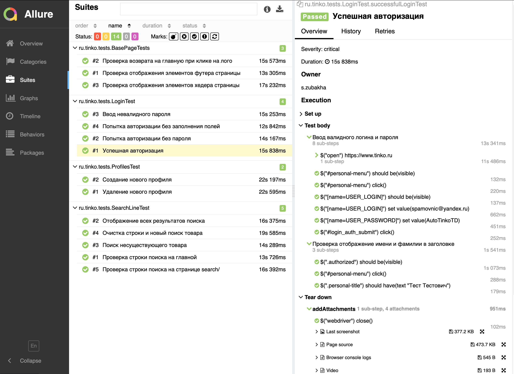
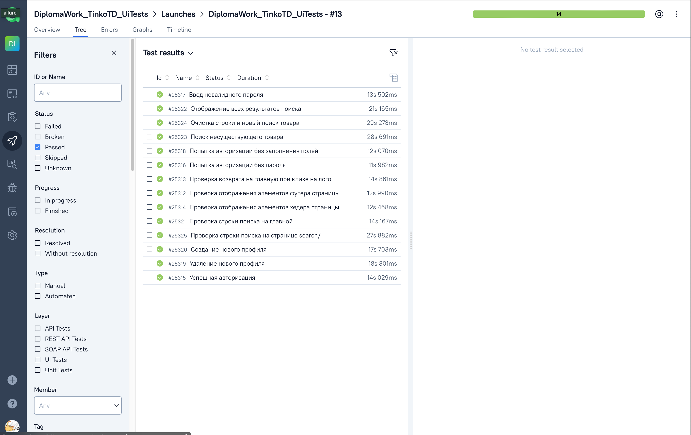
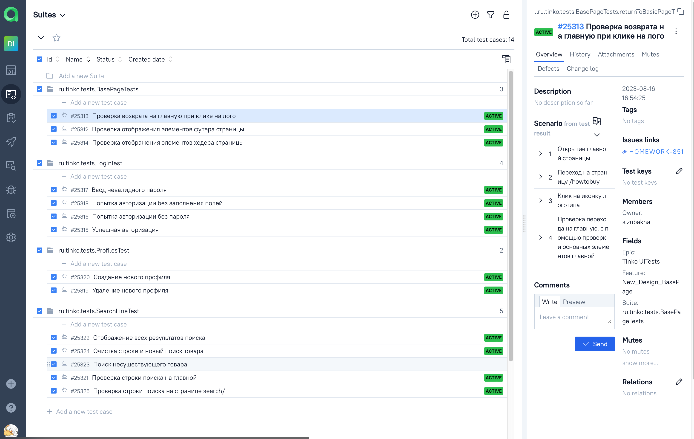
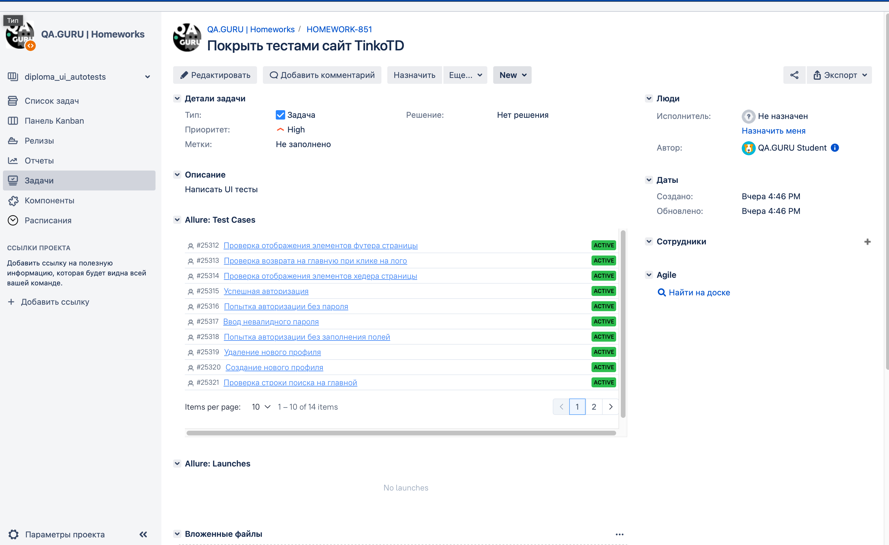
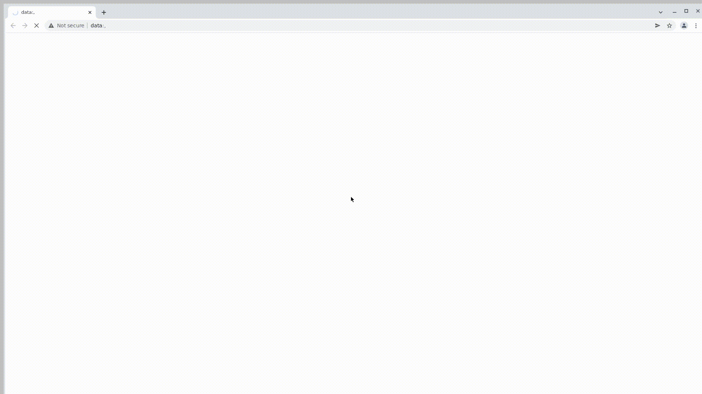

# Дипломный проект по автоматизации тестирования сайта <a href="https://https://www.tinko.ru// ">ТинкоТД</a></h1>

### Технологии и инструменты:
<p align="center">


</p>

### Реализованные проверки:
* Проверка отображения элементов хедера страницы
* Проверка возврата на главную при клике на лого
* Проверка отображения элементов футера страницы
* Успешная авторизация
* Ввод невалидного пароля
* Попытка авторизации без заполнения обязательных полей
* Создание нового профиля
* Удаление созданного профиля
* Проверка сторки поиска товаров

### Запуск тестов из терминала
#### Локальный запуск тестов:
```bash
gradle clean test
```

#### Удаленный запуск тестов с параметрами:

```bash
gradle clean test
-DbaseUrl=${BASE_URL}
-DselenoidUrl=${SELENOID_URL}
-DbrowserSize=${BROWSER_SIZE}

```

> `${BROWSER}` - наименование браузера (_по умолчанию - <code>chrome</code>_).
>
> `${BROWSER_VERSION}` - версия браузера (_по умолчанию - <code>100.0</code>_).
>
> `${BROWSER_SIZE}` - размер окна браузера (_по умолчанию - <code>1920x1080</code>_).
>
> `${REMOTE_URL}` - адрес удаленного сервера, на котором будут запускаться тесты.

### Запуск тестов в Jenkins
<a target="_blank" href="https://jenkins.autotests.cloud/job/AD_demo_ui_steam/">Сборка в Jenkins</a>
<p align="center">

</p>

### Отчет в Allure report
#### Основная страница отчета
<p align="center">

</p>

#### Тест-кейсы
<p align="center">

</p>

### Интеграция с Allure TestOps
#### Dashboard
<p align="center">

</p>

#### Тест-кейсы
<p align="center">

</p>

### Интеграция с Jira
<p align="center">

</p>

### Уведомления в Telegram с использованием бота
<p align="center">

</p>

### Пример видео выполнения теста на Selenoid
<p align="center">
  
</p>
